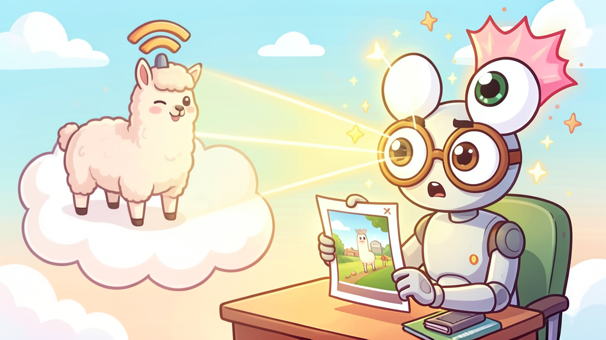

# image-comprehension-ollama-cloud

[](https://opensource.org/licenses/MIT)
[](https://ollama.com)

<p align="center">
  
</p>

Give your coding agent cloud-powered vision. This skill analyzes image files using Ollama's cloud vision models — no local Ollama installation, no GPU, no model downloads required. Just an API key.

When an agent encounters a screenshot, chart, diagram, photo, or any image file, it calls this skill to get a detailed text description. Everything runs on Ollama's cloud — no local setup needed.

**This is the cloud counterpart to [image-comprehension-ollama](https://github.com/aosama/image-comprehension-ollama).** Choose this skill when you want zero local setup or access to larger models. Choose the local skill when privacy matters or you have a GPU.

## Install

```bash
npx skills add aosama/image-comprehension-ollama-cloud
```

### Prerequisites

1. **`curl`**, **`jq`**, and **`base64`** — Available on most systems by default.
2. **Ollama Cloud API key** — Get one at [ollama.com/settings/keys](https://ollama.com/settings/keys) (free Ollama account required).

```bash
export OLLAMA_CLOUD_API_KEY=<your-api-key>
```

### Supported cloud vision models

| Model | Quality | Notes |
|-------|---------|-------|
| `gemma4:31b-cloud` | Excellent | **Default.** Best quality via Ollama Cloud |
| `gemma4:e2b` | Excellent | High quality, local or cloud |
| `llava:7b` | Strong | Good balance of quality and speed |
| `qwen3-vl:235b` | Excellent | Larger model, best accuracy |

Use `--model` or `OLLAMA_CLOUD_MODEL` to switch.

## Features

- ☁️ **Cloud-powered** — Uses Ollama's cloud API, no local Ollama needed
- 🔑 **API key auth** — Simple `OLLAMA_CLOUD_API_KEY` env var
- 🖼️ **Multi-format** — Supports PNG, JPEG, GIF, WebP, BMP
- 🐚 **Pure shell** — Only `curl`, `jq`, and `base64` required (no Python, no Node.js)
- 🔧 **Configurable model** — Use any Ollama Cloud vision model, defaults to `gemma4:31b-cloud`
- 📝 **Custom prompts** — Ask specific questions about images
- 🔒 **Privacy-aware** — Clear documentation that images are sent to cloud

## Repository structure

```
image-comprehension-ollama-cloud/
├── .github/
│   └── workflows/
│       └── ci.yml
├── .gitignore
├── AGENTS.md
├── CONTRIBUTING.md
├── LICENSE
├── README.md
├── VERSIONS.md
└── skills/
    └── image-comprehension-ollama-cloud/
        ├── SKILL.md
        └── scripts/
            └── comprehend_image_ollama_cloud.sh
```

This follows the [Agent Skills specification](https://agentskills.io/specification.md).

## Usage

```bash
# Basic usage — describe an image
./skills/image-comprehension-ollama-cloud/scripts/comprehend_image_ollama_cloud.sh --image screenshot.png

# Ask a specific question about an image
./skills/image-comprehension-ollama-cloud/scripts/comprehend_image_ollama_cloud.sh --image chart.png --prompt "What are the key trends?"

# Extract text from an image
./skills/image-comprehension-ollama-cloud/scripts/comprehend_image_ollama_cloud.sh --image receipt.jpg --prompt "Extract and transcribe all visible text."

# Use a different model
./skills/image-comprehension-ollama-cloud/scripts/comprehend_image_ollama_cloud.sh --image photo.png --model qwen3-vl:235b

# Or set model via environment variable
OLLAMA_CLOUD_MODEL=llava:7b ./skills/image-comprehension-ollama-cloud/scripts/comprehend_image_ollama_cloud.sh --image photo.png

# Run the built-in smoke test (makes a real API call)
./skills/image-comprehension-ollama-cloud/scripts/comprehend_image_ollama_cloud.sh --test

# Show help
./skills/image-comprehension-ollama-cloud/scripts/comprehend_image_ollama_cloud.sh --help
```

## Configuration

| Setting | CLI flag | Environment variable | Default |
|---------|----------|---------------------|---------|
| API key | — | `OLLAMA_CLOUD_API_KEY` | *(required)* |
| Vision model | `--model` | `OLLAMA_CLOUD_MODEL` | `gemma4:31b-cloud` |
| Timeout | — | `COMPREHEND_IMAGE_CLOUD_TIMEOUT_SECONDS` | `180` |

### Using a different model

Any Ollama Cloud vision model works. Popular options:

```bash
# Override on the command line
./skills/image-comprehension-ollama-cloud/scripts/comprehend_image_ollama_cloud.sh --image photo.png --model llava:7b

# Or set via environment variable
export OLLAMA_CLOUD_MODEL=qwen3-vl:235b
```

The `--model` flag takes precedence over `OLLAMA_CLOUD_MODEL`. If neither is set, `gemma4:31b-cloud` is used.

## Privacy

**This skill sends your images to Ollama's cloud service for processing.** Your API key, image data, and prompts are transmitted over HTTPS to `ollama.com`. If you need fully local image analysis without data leaving your machine, use [image-comprehension-ollama](https://github.com/aosama/image-comprehension-ollama) instead.

## Output

- **stdout** — The image description (capture this for programmatic use)
- **stderr** — Progress logs and error messages

```bash
# Capture only the description
description=$(./skills/image-comprehension-ollama-cloud/scripts/comprehend_image_ollama_cloud.sh --image photo.png 2>/dev/null)
```

## How it works

1. Validates that `curl`, `jq`, and `base64` are available
2. Validates the `OLLAMA_CLOUD_API_KEY` environment variable is set
3. Base64-encodes the image file
4. Sends a POST request to `https://ollama.com/api/generate` with:
   - The specified model (default: `gemma4:31b-cloud`)
   - The prompt and base64-encoded image
   - `Authorization: Bearer` header with the API key
   - `stream: false` for a complete response
5. Parses the JSON response and prints the description to stdout
6. HTTP errors produce clear, actionable error messages

## Comparison with the local skill

| | [image-comprehension-ollama](https://github.com/aosama/image-comprehension-ollama) | image-comprehension-ollama-cloud |
|---|---|---|
| Ollama | Local install required | No install needed |
| Model storage | Local disk (`ollama pull`) | Cloud (always available) |
| GPU required | Yes (for speed) | No |
| Privacy | Images stay local | Images sent to cloud |
| Cost | Free | Billed per usage |
| Default model | `moondream:1.8b` | `gemma4:31b-cloud` |
| Dependencies | Python 3, local Ollama | `curl`, `jq`, `base64` |

## Troubleshooting

| Error | Solution |
|-------|----------|
| `OLLAMA_CLOUD_API_KEY environment variable is not set` | Set it: `export OLLAMA_CLOUD_API_KEY=<key>`. Get a key at https://ollama.com/settings/keys |
| `Missing dependency: curl/jq/base64` | Install via your package manager (`brew install curl jq` on macOS) |
| `API returned HTTP 401` | API key is invalid or expired. Check at https://ollama.com/settings/keys |
| `API returned HTTP 429` | Rate limited. Wait and try again |
| `API returned HTTP 5xx` | Ollama Cloud is having issues. Try again later |
| `Image file not found` | Check the path is correct |
| `Unsupported image format` | Use PNG, JPEG, GIF, WebP, or BMP |

## License

This project is licensed under the [MIT License](LICENSE).